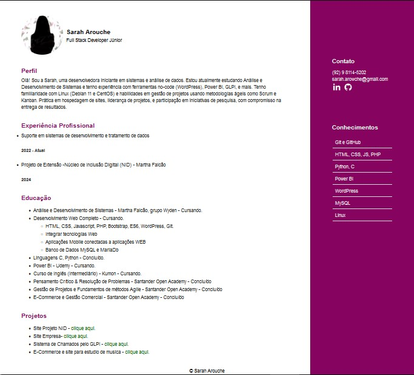
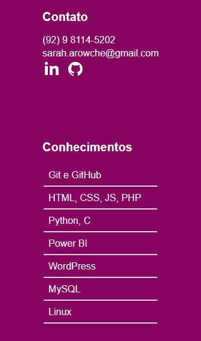

# Site - Trabalho Dev. Web - HTML e CSS 💻

## Sobre o projeto 📟

### Curriculo

O site foi criado para um trabalho de HTML e CSS no curso de desenvolvimento web da Martha Falcao, ministrado pelo professor Joaquim Junior.

O conteúdo é voltado com informações curriculares, utilizando apenas HTML e CSS.  

## Tecnologias utilizadas 🛠

### Front End
- HTML
- CSS
